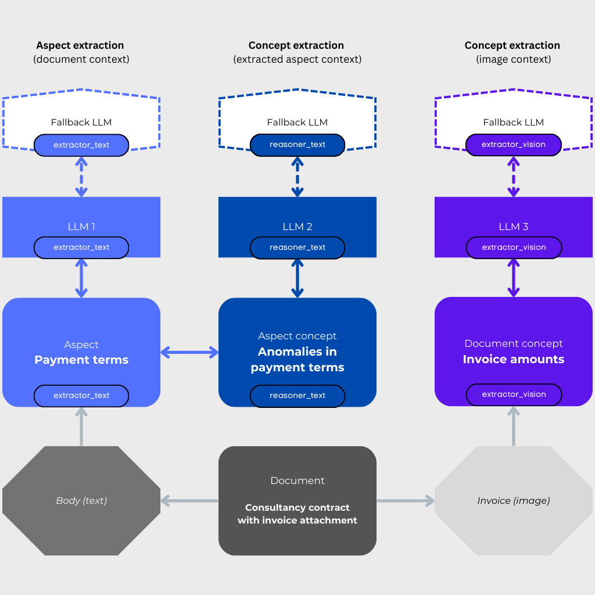

.. 
   ContextGem
   
   Copyright 2025 Shcherbak AI AS. All rights reserved. Developed by Sergii Shcherbak.
   
   Licensed under the Apache License, Version 2.0 (the "License");
   you may not use this file except in compliance with the License.
   You may obtain a copy of the License at
   
       http://www.apache.org/licenses/LICENSE-2.0
   
   Unless required by applicable law or agreed to in writing, software
   distributed under the License is distributed on an "AS IS" BASIS,
   WITHOUT WARRANTIES OR CONDITIONS OF ANY KIND, either express or implied.
   See the License for the specific language governing permissions and
   limitations under the License.

How it works
=============

📏 Leveraging LLM Context Windows
----------------------------------

ContextGem leverages LLMs' long context windows to deliver superior extraction accuracy. Unlike RAG approaches that often `struggle with complex concepts and nuanced insights <https://www.linkedin.com/pulse/raging-contracts-pitfalls-rag-contract-review-shcherbak-ai-ptg3f/>`_, ContextGem is betting on the `continuously expanding context capacity <https://arxiv.org/abs/2502.12962>`_, evolving capabilities of modern LLMs, and constantly decreasing LLM costs. This approach enables direct information extraction from full documents, eliminating retrieval inconsistencies and capturing the complete context necessary for accurate understanding.

🧩 Core Components
-------------------

ContextGem's main elements are the Document, Aspect, and Concept models:

📄 **Document**
~~~~~~~~~~~~~~~~

:class:`~contextgem.public.documents.Document` model contains text and/or visual content representing a specific document. Documents can vary in type and purpose, including but not limited to:
    - *Contracts*: legal agreements defining terms and obligations.
    - *Invoices*: financial documents detailing transactions and payments.
    - *Curricula Vitae (CVs)*: resumes outlining an individual's professional experience and qualifications.
    - *General documents*: any other types of documents that may contain text or images.

🔍 **Aspect**
~~~~~~~~~~~~~~~

:class:`~contextgem.public.aspects.Aspect` model contains text representing a defined area or topic within a document (or another aspect) that requires focused attention. Each aspect reflects a specific subject or theme. For example:
    - *Contract aspects*: payment terms, parties involved, or termination clauses.
    - *Invoice aspects*: due dates, line-item breakdowns, or tax details.
    - *CV aspects*: work experience, education, or skills.
    
Aspects may have sub-aspects, for more granular extraction with nested context. This hierarchical structure allows for progressive refinement of focus areas, enabling precise extraction of information from complex documents while maintaining the contextual relationships between different levels of content.

💡 **Concept**
~~~~~~~~~~~~~~~

Concept model contains a unit of information or an entity, derived from an aspect or the broader document context. Concepts represent a wide range of data points and insights, from simple entities (names, dates, monetary values) to complex evaluations, conclusions, and answers to specific questions. Concepts can be:
    - *Factual extractions*: such as a penalty clause in a contract, a total amount due in an invoice, or a certification in a CV.
    - *Analytical insights*: such as risk assessments, compliance evaluations, or pattern identifications.
    - *Reasoned conclusions*: such as determining whether a document meets specific criteria or answers particular questions.
    - *Interpretative judgments*: such as ratings, classifications, or qualitative assessments based on document content.

Concepts may be attached to an aspect or a document. The context for the concept extraction will be the aspect or document, respectively. This flexible attachment allows for both targeted extraction from specific document sections and broader analysis across the entire document content. When attached to aspects, concepts benefit from the focused context, enabling more precise extraction of domain-specific information. When attached to documents, concepts can leverage the complete context to identify patterns, anomalies, or insights that span multiple sections.

Multiple concept types are supported: :class:`~contextgem.public.concepts.StringConcept`, :class:`~contextgem.public.concepts.BooleanConcept`, :class:`~contextgem.public.concepts.NumericalConcept`, :class:`~contextgem.public.concepts.DateConcept`, :class:`~contextgem.public.concepts.JsonObjectConcept`, :class:`~contextgem.public.concepts.RatingConcept`

.. list-table:: Component Examples
   :header-rows: 1
   :widths: 15 20 20 20 20

   * - 
     - Document
     - Aspect
     - Sub-aspect
     - Concept
   * - **Legal**
     - *Software License Agreement*
     - Intellectual Property Rights
     - Patent Indemnification
     - Indemnification Coverage Scope (``JsonObjectConcept``)
   * - **Financial**
     - *Quarterly Earnings Report*
     - Revenue Analysis
     - Regional Performance
     - Year-over-Year Growth Rate (``NumericalConcept``)
   * - **Healthcare**
     - *Medical Research Paper*
     - Methodology
     - Patient Selection Criteria
     - Inclusion/Exclusion Validity (``BooleanConcept``)
   * - **Technical**
     - *System Architecture Document*
     - Security Framework
     - Authentication Protocols
     - Implementation Risk Rating (``RatingConcept``)
   * - **HR**
     - *Employee Handbook*
     - Leave Policy
     - Parental Leave Benefits
     - Eligibility Start Date (``DateConcept``)

🔄 Extraction Workflow
-----------------------

ContextGem uses the following models to extract information from documents:

🤖 **DocumentLLM**
~~~~~~~~~~~~~~~~~~~

**A single configurable LLM with a specific role to extract specific information from the document.**

The ``llm_role`` of an LLM is an abstraction to differentiate between tasks of different complexity. For example, if an aspect/concept is assigned ``llm_role="extractor_text"``, it means that the aspect/concept is extracted from the document using the LLM with the role "extractor_text". This helps to channel different tasks to different LLMs, ensuring that the task is handled by the most appropriate model. Usually, domain expertise is required to determine the most appropriate role for a specific aspect/concept. But for simple use cases, you can skip the role assignment completely, in which case the role will default to "extractor_text".

An LLM can have any of the pre-defined roles assigned to it, irrespective of whether it is actually a "reasoning" model (e.g. o3-mini) or not (e.g. gpt-4o) - it is up to you to decide based on the capabilities of the LLM and the complexity of the task.

An LLM can have a configurable fallback LLM with the same role.

See :class:`~contextgem.public.llms.DocumentLLM` for more details.

🤖🤖 **DocumentLLMGroup**
~~~~~~~~~~~~~~~~~~~~~~~~~~~

**A group of LLMs with different unique roles to extract different information from the document.**

For more complex and granular extraction workflows, an LLM group can be used to extract different information from the same document using different LLMs with different roles. For example, a simpler LLM e.g. gpt-4o-mini can be used to extract specific aspects of the document, and a more powerful LLM e.g. o3-mini will handle the extraction of complex concepts that require reasoning over the aspects' context.

Each LLM can have its own backend and configuration, and one fallback LLM with the same role.

See :class:`~contextgem.public.llms.DocumentLLMGroup` for more details.

.. list-table:: LLM Group Workflow Example
   :header-rows: 1
   :widths: 15 20 20 20

   * - 
     - LLM 1 (``extractor_text``)
     - LLM 2 (``reasoner_text``)
     - LLM 3 (``extractor_vision``)
   * - *Model*
     - gpt-4o-mini
     - gpt-4o
     - gpt-4o-mini
   * - *Task*
     - Extract payment terms from a contract
     - Detect anomalies in the payment terms
     - Extract invoice amounts
   * - *Fallback LLM* (optional)
     - gpt-3.5-turbo
     - claude-3-5-sonnet
     - gpt-4o

ℹ️ What ContextGem Doesn't Offer (Yet)
---------------------------------------

While ContextGem excels at structured data extraction from individual documents, it's important to understand its intentional design boundaries:

**Not a RAG framework**
~~~~~~~~~~~~~~~~~~~~~~~

ContextGem focuses on in-depth single-document analysis, leveraging long context windows of LLMs for maximum accuracy and precision. It does not offer RAG capabilities for cross-document querying or corpus-wide information retrieval. For these use cases, traditional RAG systems such as LlamaIndex remain more appropriate.

**Not an agent framework**
~~~~~~~~~~~~~~~~~~~~~~~~~~

ContextGem is not designed as an agent framework. Based on our research into practical extraction workflows, we believe that in-depth single-document data extraction can be handled more efficiently with non-agentic LLM workflows. For use cases that require agents, we recommend using frameworks like LangChain. ContextGem can still be easily integrated as a tool within agent frameworks due to its simple API and clear output structure, making it an excellent choice for document extraction tasks within larger agent-based systems.
