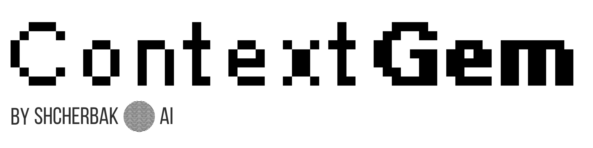
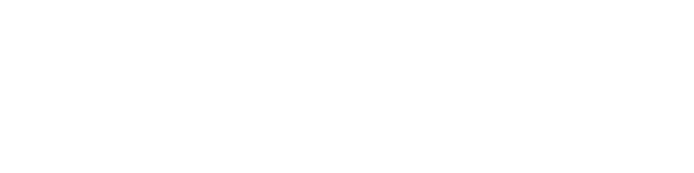

.. 
   ContextGem
   
   Copyright 2025 Shcherbak AI AS. All rights reserved. Developed by Sergii Shcherbak.
   
   Licensed under the Apache License, Version 2.0 (the "License");
   you may not use this file except in compliance with the License.
   You may obtain a copy of the License at
   
       http://www.apache.org/licenses/LICENSE-2.0
   
   Unless required by applicable law or agreed to in writing, software
   distributed under the License is distributed on an "AS IS" BASIS,
   WITHOUT WARRANTIES OR CONDITIONS OF ANY KIND, either express or implied.
   See the License for the specific language governing permissions and
   limitations under the License.

:og:description: ContextGem: Easier and faster way to build LLM extraction workflows through powerful abstractions.

|

Welcome to ContextGem Documentation!
=====================================

ContextGem is an LLM framework for faster, easier extraction of structured data and insights from documents through powerful abstractions.

|

.. grid:: 2 2 3 3
    :gutter: 3
    :padding: 0
    
    .. grid-item-card:: 📚 Project Description
        :link: motivation
        :link-type: doc
        :class-card: sd-border-0 sd-shadow-sm sd-card-hover
        
        Learn about the motivation, comparisons with other frameworks, and how ContextGem works.
        
        +++
        .. button-ref:: motivation
            :ref-type: doc
            :click-parent:
            :color: primary
            :outline:
            :expand:
            
            Learn More
            
    .. grid-item-card:: 🚀 Getting Started
        :link: installation
        :link-type: doc
        :class-card: sd-border-0 sd-shadow-sm sd-card-hover
        
        Instructions to install ContextGem and quickly start using it.
        
        +++
        .. button-ref:: installation
            :ref-type: doc
            :click-parent:
            :color: primary
            :outline:
            :expand:
            
            Get Started
    
    .. grid-item-card:: 🔍 Advanced Usage
        :link: advanced_usage
        :link-type: doc
        :class-card: sd-border-0 sd-shadow-sm sd-card-hover
        
        Explore advanced features and techniques for extracting data from documents.
        
        +++
        .. button-ref:: advanced_usage
            :ref-type: doc
            :click-parent:
            :color: primary
            :outline:
            :expand:
            
            Explore
    
    .. grid-item-card:: ⚙️ Optimization Guide
        :link: optimizations/optimization_choosing_llm
        :link-type: doc
        :class-card: sd-border-0 sd-shadow-sm sd-card-hover
        
        Learn how to optimize your extraction pipeline for accuracy, cost, and performance.
        
        +++
        .. button-ref:: optimizations/optimization_choosing_llm
            :ref-type: doc
            :click-parent:
            :color: primary
            :outline:
            :expand:
            
            Optimize
    
    .. grid-item-card:: 📖 API Reference
        :link: api/documents
        :link-type: doc
        :class-card: sd-border-0 sd-shadow-sm sd-card-hover
        
        Complete API documentation for all ContextGem modules and classes.
        
        +++
        .. button-ref:: api/documents
            :ref-type: doc
            :click-parent:
            :color: primary
            :outline:
            :expand:
            
            View API

|

Indices and tables
-------------------

* :ref:`genindex`
* :ref:`modindex`
* :ref:`search`

.. Navigation structure (hidden from page, visible in sidebar)

.. toctree::
   :maxdepth: 2
   :caption: Project Description
   :hidden:
   
   motivation
   vs_other_frameworks
   how_it_works

.. toctree::
   :maxdepth: 2
   :caption: Getting Started
   :hidden:
   
   installation
   quickstart

.. toctree::
   :maxdepth: 2
   :caption: Advanced Usage
   :hidden:
   
   advanced_usage

.. toctree::
   :maxdepth: 2
   :caption: Optimization Guide
   :hidden:
   
   optimizations/optimization_choosing_llm
   optimizations/optimization_accuracy
   optimizations/optimization_speed
   optimizations/optimization_cost
   optimizations/optimization_long_docs

.. toctree::
   :maxdepth: 2
   :caption: API Reference
   :hidden:
   
   api/documents
   api/aspects
   api/concepts
   api/examples
   api/llms
   api/data_models
   api/utils
   api/images
   api/paragraphs
   api/sentences
   api/pipelines
